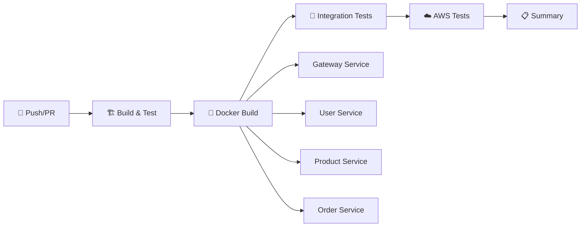

# 🚀 Compose Portal Application

A **multi-module Spring Boot microservices** project with 4 independent services, static data, Thymeleaf pages, REST APIs, and ready for Docker/Kubernetes/AWS deployment with full CI/CD pipeline.

## 🏗️ Architecture

```
compose-portal-application/          (Parent POM)
├── gateway-service/                 (Port 8080 - Dashboard & Service Registry)
├── user-service/                    (Port 8081 - User Management)
├── product-service/                 (Port 8082 - Product Catalog)
├── order-service/                   (Port 8083 - Order Management)
├── .github/workflows/               (GitHub Actions CI/CD)
├── scripts/                         (Validation & Helper Scripts)
├── docker-compose.yml
├── pom.xml                          (Parent POM)
└── README.md
```

## 🛠️ Tech Stack

| Technology       | Purpose                    |
|-----------------|----------------------------|
| Java 17         | Core Language              |
| Spring Boot 3.2 | Application Framework      |
| Thymeleaf       | Server-Side Templates      |
| Maven           | Build & Dependency Mgmt    |
| Spring Actuator | Health & Monitoring        |
| Docker          | Containerization           |
| Docker Compose  | Multi-Container Orchestration |
| GitHub Actions  | CI/CD Pipeline             |

## 🔄 CI/CD Pipeline

### 📊 Pipeline Overview
The GitHub Actions workflow automatically builds, tests, and validates all 4 services:



### 🎯 Pipeline Jobs

| Job | Description | Outputs |
|-----|-------------|---------|
| **🏗️ Build & Test** | Maven clean package, run tests | JAR artifacts |
| **🐳 Docker Build** | Build 4 Docker images in parallel | Docker images |
| **🧪 Integration Tests** | Health checks via Docker Compose | Test results |
| **☁️ AWS Connection** | Test AWS credentials (manual) | Connection status |
| **📋 Build Summary** | Comprehensive build report | Artifacts list |

### 🐳 Docker Images Produced
- `compose-portal/gateway-service:v2.4.1`
- `compose-portal/user-service:v2.4.1`
- `compose-portal/product-service:v2.4.1`
- `compose-portal/order-service:v2.4.1`

## 🚀 Quick Start

### Prerequisites
- Java 17+
- Maven 3.8+
- Docker & Docker Compose (optional, for containerized run)

### 🏗️ Build All Modules
```bash
mvn clean install
```

### 🔧 Local Validation (Mimics CI/CD)
```powershell
# Run the full validation pipeline locally
.\scripts\local-build-validation.ps1
```

### 📊 Monitor GitHub Actions
```powershell
# Check workflow status and recent runs
.\scripts\check-workflow-status.ps1

# Watch workflow status in real-time  
.\scripts\check-workflow-status.ps1 -Watch
```

### 🏃 Run Individual Services
Open 4 separate terminals:
```bash
# Terminal 1 - User Service
cd user-service && mvn spring-boot:run

# Terminal 2 - Product Service
cd product-service && mvn spring-boot:run

# Terminal 3 - Order Service
cd order-service && mvn spring-boot:run

# Terminal 4 - Gateway Service
cd gateway-service && mvn spring-boot:run
```

### 🐳 Run with Docker Compose
```bash
mvn clean package -DskipTests
docker-compose up --build
```
cd order-service && mvn spring-boot:run

# Terminal 4 - Gateway Service
cd gateway-service && mvn spring-boot:run
```

### Run with Docker Compose
```bash
mvn clean package -DskipTests
docker-compose up --build
```

## 🌐 Service URLs

| Service          | URL                          | Description                      |
|-----------------|------------------------------|----------------------------------|
| Gateway Dashboard| http://localhost:8080        | Main Portal Dashboard            |
| User Service     | http://localhost:8081        | User Management Pages            |
| Product Service  | http://localhost:8082        | Product Catalog Pages            |
| Order Service    | http://localhost:8083        | Order Management Pages           |

## 📡 REST API Endpoints

### User Service (Port 8081)
| Method | Endpoint                          | Description              |
|--------|----------------------------------|--------------------------|
| GET    | `/api/users`                     | Get all users            |
| GET    | `/api/users/{id}`                | Get user by ID           |
| POST   | `/api/users`                     | Create a user            |
| PUT    | `/api/users/{id}`                | Update a user            |
| DELETE | `/api/users/{id}`                | Delete a user            |
| GET    | `/api/users/department/{dept}`   | Get users by department  |
| GET    | `/api/users/status/{status}`     | Get users by status      |

### Product Service (Port 8082)
| Method | Endpoint                          | Description              |
|--------|----------------------------------|--------------------------|
| GET    | `/api/products`                  | Get all products         |
| GET    | `/api/products/{id}`             | Get product by ID        |
| POST   | `/api/products`                  | Create a product         |
| PUT    | `/api/products/{id}`             | Update a product         |
| DELETE | `/api/products/{id}`             | Delete a product         |
| GET    | `/api/products/category/{cat}`   | Get products by category |

### Order Service (Port 8083)
| Method | Endpoint                          | Description              |
|--------|----------------------------------|--------------------------|
| GET    | `/api/orders`                    | Get all orders           |
| GET    | `/api/orders/{id}`               | Get order by ID          |
| POST   | `/api/orders`                    | Create an order          |
| PUT    | `/api/orders/{id}`               | Update an order          |
| DELETE | `/api/orders/{id}`               | Delete an order          |
| GET    | `/api/orders/status/{status}`    | Get orders by status     |
| GET    | `/api/orders/user/{userId}`      | Get orders by user ID    |

### Gateway Service (Port 8080)
| Method | Endpoint                          | Description              |
|--------|----------------------------------|--------------------------|
| GET    | `/api/gateway/services`          | List all services        |
| GET    | `/api/gateway/health`            | All services health      |

## 📋 Static Data

- **8 Users** — across 6 departments with 3 roles (ADMIN, MANAGER, USER)
- **10 Products** — across 6 categories with pricing and stock
- **8 Orders** — with multiple items, statuses, shipping addresses

## 🐳 Docker Support

Each service has its own `Dockerfile`. The `docker-compose.yml` orchestrates all 4 services with:
- Internal network communication
- Health checks
- Environment-based service URL configuration

## ☸️ Kubernetes Ready

The project is structured for easy K8s deployment:
- Each service is an independent deployable unit
- Health endpoints available for liveness/readiness probes
- Environment variables for service discovery

## ➕ Adding a New Module

1. Create a new folder (e.g., `notification-service/`)
2. Add a `pom.xml` with the parent reference
3. Add the module to parent `pom.xml` `<modules>` section
4. Create your Spring Boot application, controllers, and templates
5. Add a `Dockerfile`
6. Add the service to `docker-compose.yml`

## 📄 License

This project is for learning and demonstration purposes.

